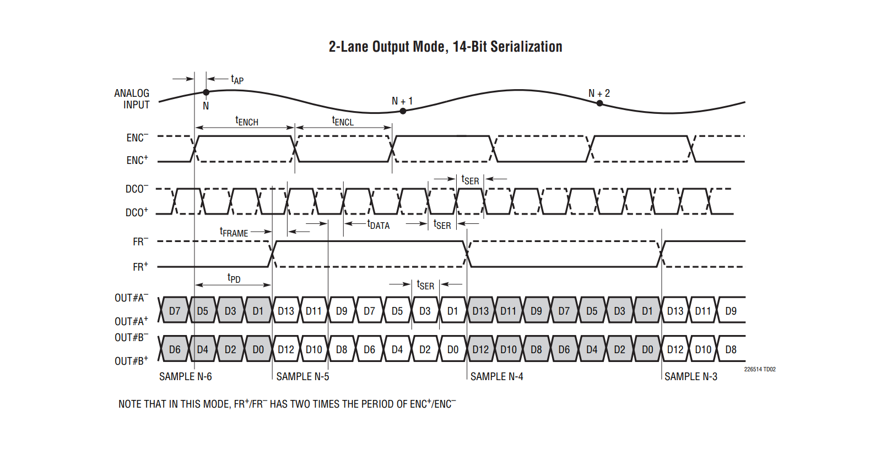
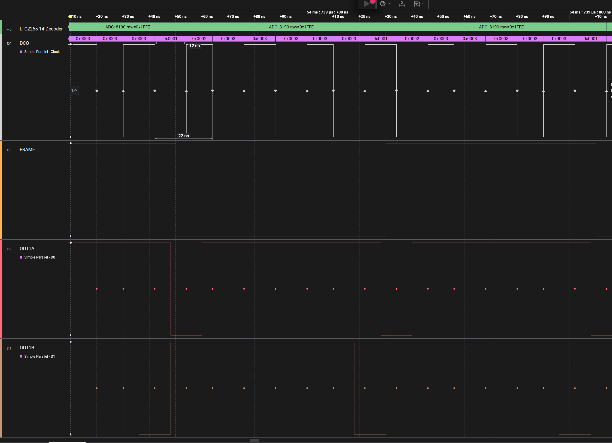
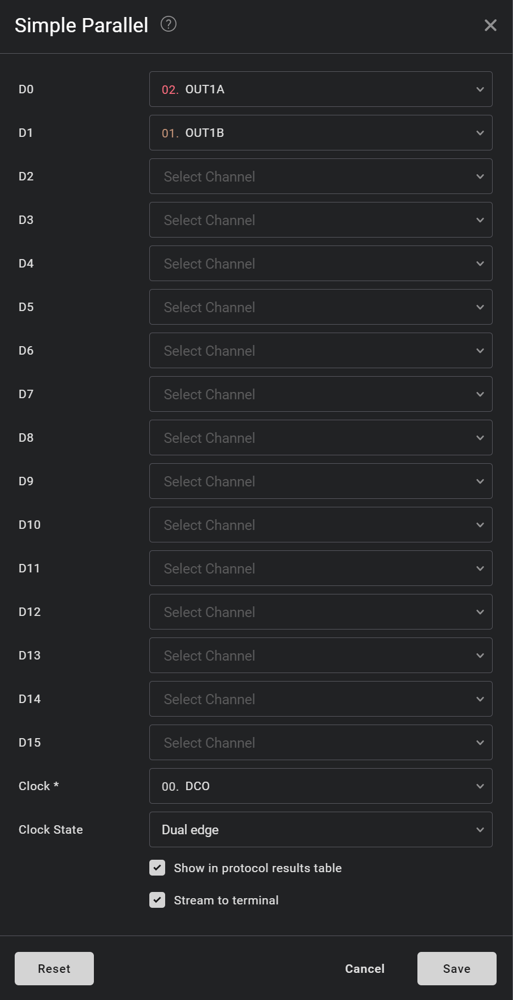
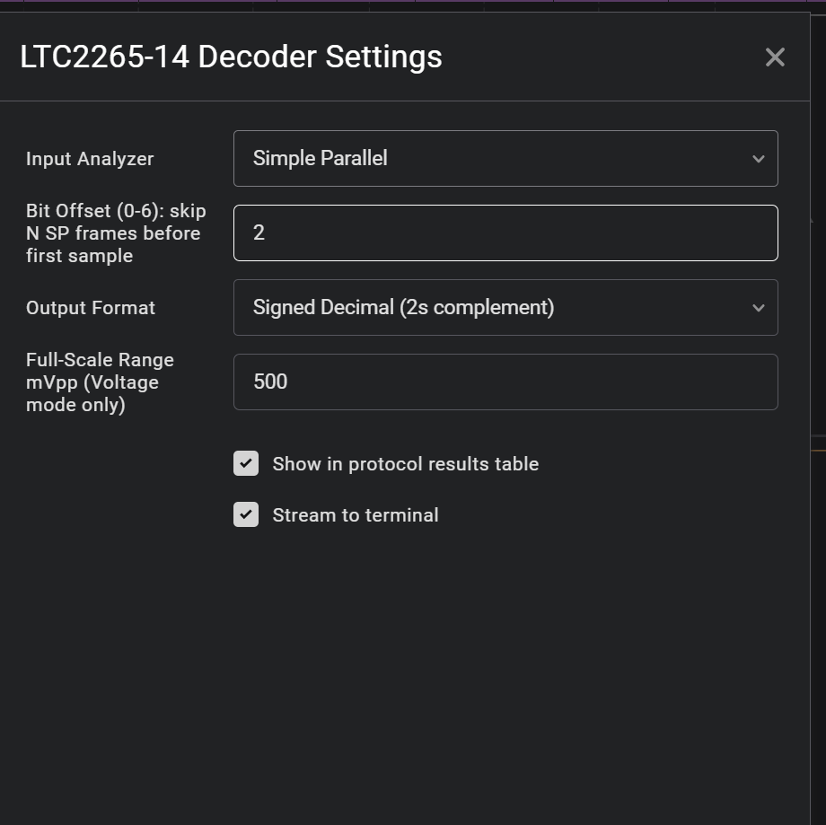

# LTC2265-14 Saleae Logic HLA

Simple Saleae Logic 2 high-level analyzer for decoding 2-lane, 14-bit serialized LTC2265-14 data from a parallel analyzer input.

### LTC2265-14 Datasheet Timing

## Usage

### Connect ADC to Logic 2 Inputs

### Configure Serial Protocol Analyzer

### Configure High-Level Analyzer

